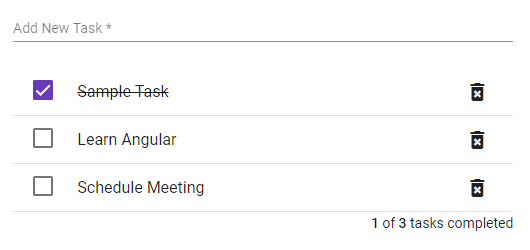

# To do list component
A to do list component using angular material

<p align="center">
    
</p>
[Click to see the demo](https://angular-material-todolist-2rug3q.stackblitz.io)


## Adding to do list component in your project

```html

<mat-to-do-list [taskList]="taskData" (updateTask)="showTasks($event)"></mat-to-do-list>

```
taskData is the input for the to do list of type Task

## Task Interface
```typescript

Task {
  id: number;
  name: string;
  completed: boolean;
}
  
```

## Listening to events
```typescript

  showTasks(tasks: Task[]) {
    console.log(tasks);
  }
  
```
## Method
Use getToDoList() of ToDoListComponent using @ViewChild decorator

```typescript

  @ViewChild(ToDoListComponent)
  private ToDoListComponent: ToDoListComponent
  
  ...
  showTaskToDo() {
    console.log(this.ToDoListComponent.getToDoList());
  }
    
```
This method would return a object which has tasks:Task[], completedTasks:Task[] and inCompletedTasks:Task[]

Import the required components from @angular/material 

